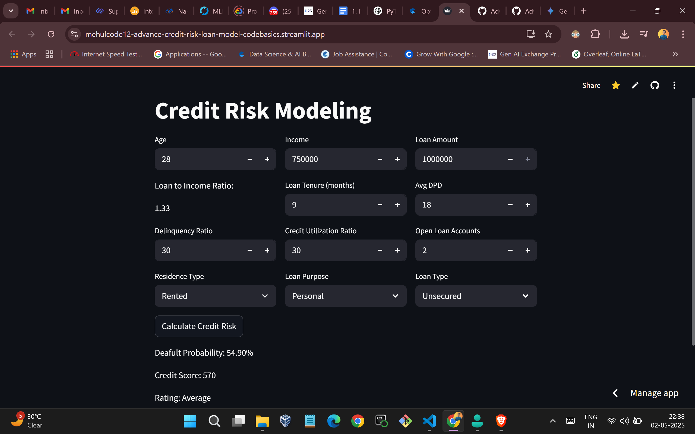
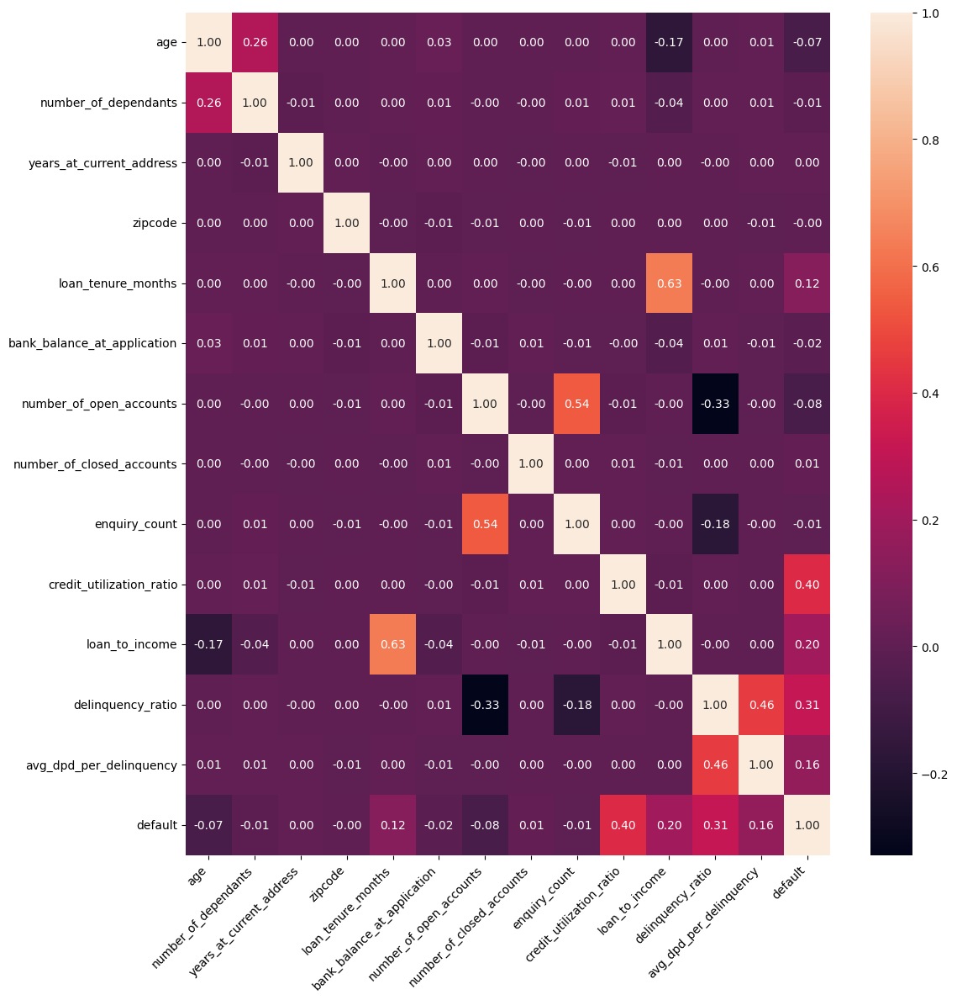
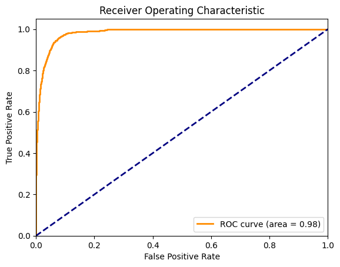
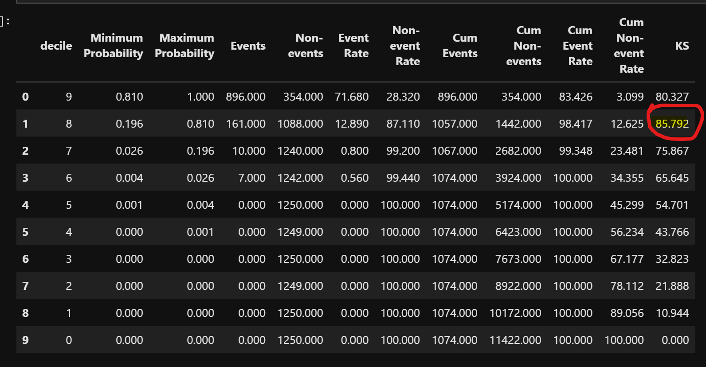

# Advance Credit Risk Modeling - Loan Default Prediction



This project presents a full-cycle **Credit Risk Modeling** solution to predict the likelihood of a borrower defaulting on a loan. It involves meticulous data cleaning, feature engineering, model training, business-aligned metric optimization, and deployment using Streamlit. Designed with real-world financial services impact in mind, the model prioritizes **recall** to minimize false negatives (i.e., not catching risky borrowers).

---

## 🚀 Project Overview

- **Goal:** Predict whether a borrower will default on a loan.
- **Dataset:** Provided by a financial institution with borrower-level and loan-level details.
- **Target Variable:** `default` (1 = default, 0 = not default)
- **Business Objective:** High **recall** for defaulters to minimize risk exposure.
- **Deployment:** Web app hosted using Streamlit Cloud.

---

## 📊 Exploratory Data Analysis (EDA) & Preprocessing

### ✅ Class Imbalance
The dataset was highly imbalanced:
- Techniques used: **SMOTE-Tomek**, **oversampling**, and **threshold tuning**.

### 🛑 Data Leakage
Handled properly by eliminating leak-prone features like `disbursal_date`, `installment_start_dt`, and derived leakage indicators.

### 📉 Processing Fee Anomaly
Boxplots revealed `processing_fee` > `loan_amount`, which is invalid. These anomalies were cleaned or capped appropriately.

### 🧼 Categorical Feature Cleaning
- `loan_purpose` cleaned and grouped into standard categories.
- One-hot encoding and WoE/IV analysis used for feature transformation and selection.

---

## 🔍 Feature Engineering

### Key New Features:
- **Loan-to-Income Ratio (LTI):** `loan_amount / income`
- **Delinquency Ratio**
- **Average DPD per Delinquency**

### Insights:
- High **LTI**, **delinquency_ratio**, and **avg_dpd_per_delinquency** were strong predictors of default.
- Defaulted customers had younger age, longer loan tenure, and higher credit utilization.

---

## 📐 Feature Selectio

### Multicollinearity Check (VIF)
Dropped correlated features: `sanction_amount`, `processing_fee`, `gst`, `net_disbursement`, `principal_outstanding`.

### WoE & IV-Based Categorical Feature Selection:
Top features:
- `credit_utilization_ratio`
- `avg_dpd_per_delinquency`
- `loan_to_income`
- `loan_purpose`
- `residence_type`
- `loan_tenure_months`
- `loan_type`
- `age`, etc.

---

## 🤖 Model Training & Optimization

### Model Attempts:
| Model | Accuracy | Recall (Defaulters) |
|-------|----------|---------------------|
| Logistic Regression (Basic) | 96% | 0.70 |
| Random Forest | 96% | 0.69 |
| XGBoost | 96% | 0.75 |

### Final Model:
- **Logistic Regression**
- **SMOTE-Tomek**
- **Optuna for Hyperparameter Tuning**
- Business chose **LogReg** for explainability

#### Final Metrics:
- **Accuracy:** 0.93
- **Recall (Defaulters):** 0.95
- **AUC:** 0.983
- **Gini Coefficient:** 0.967

---

## 📈 Model Evaluation

### Confusion Matrix


### ROC Curve


### KS Statistic
- **KS Value:** 85.98% at Decile 8
- Indicates strong rank-ordering capability.



---

## 📦 Deployment

- **App Framework:** Streamlit
- **Main Files:** `main.py`, `prediction_helper.py`
- **Hosting:** [Streamlit Cloud](https://advance-credit-risk-predictor.streamlit.app/)


---

## 🧠 Business Impact

- Enables better **credit risk filtering**.
- High recall helps reduce **bad debt**.
- Easy model interpretability aids **compliance** and **auditing**.

---

## 📁 Folder Structure

```
Advance_Credit_Risk_Model_Loan_prediction/
├── data/
├── notebooks/
├── main.py
├── prediction_helper.py
├── README.md
├── requirements.txt
├── images/
│   ├── ks_statistic.png
│   ├── roc_curve.png
│   ├── confusion_matrix.png
│   └── streamlit_app_screenshot.png
```

---

## ✍️ Author

- **Mehul Ligade**
- GitHub: [@mehulcode12](https://github.com/mehulcode12)

---

## 🙌 Acknowledgements

This project was completed as part of the Codebasics Data Science Bootcamp.
Special thanks to mentors and the open-source community for libraries and frameworks.

## 📌 Note
You are welcome to use this project as a reference. Please give credit to CodeBasics if you find it helpful.

